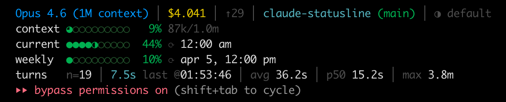

# claude-statusline

A feature-rich [custom statusline](https://code.claude.com/docs/en/statusline) for Claude Code that puts your context window, rate limits, session cost, and turn timing stats in one place — using the data Claude Code already provides.



## What it does

Claude Code's [statusline feature](https://code.claude.com/docs/en/statusline) pipes JSON session data to a shell script on every update. This project takes full advantage of that — reading every useful field from the [available data](https://code.claude.com/docs/en/statusline#available-data) and rendering it as a multi-line dashboard with color-coded progress bars.

It also uses [hooks](https://code.claude.com/docs/en/hooks) (`UserPromptSubmit` and `Stop`) to track per-turn wall-clock timing — something the statusline JSON doesn't include on its own.

**Line 1** — session overview:

Model name, session cost, output tokens, directory + git branch, session duration, thinking effort level

**Stacked bars** — usage at a glance:

| Row | What it tracks |
|-----|----------------|
| `context` | Context window usage with token counts — know when autocompact is coming |
| `current` | 5-hour rolling rate limit with countdown to reset |
| `weekly` | 7-day rate limit with reset date + time |
| `extra` | Extra usage spend tracking (if enabled on your plan) |
| `turns` | Per-turn wall-clock timing: count, last + completion time, avg, p50, max |

### Details

- Progress bars use gradual-fill dots (`○ ◔ ◑ ◕ ●`) that color-shift from green to red as usage climbs
- Context window tracks `input_tokens + cache_creation + cache_read` against `context_window_size`, matching Claude Code's own `used_percentage` calculation
- Rate limits come from the `rate_limits` object in the statusline JSON (available for Pro/Max subscribers after the first API response)
- Reset times show relative countdowns when in the future, absolute times when stale
- Turn timing captures full wall-clock time per turn — thinking, tool calls, subagent orchestration — not just API latency
- Turn stats include the HH:MM:SS timestamp of the last completion so you can tell at a glance when Claude last finished working

## Choose your flavor

Two implementations, identical output — pick what fits your stack:

| | [`ts/`](ts/) | [`sh/`](sh/) |
|---|---|---|
| **Files** | 1 (`statusline.ts`) | 3 (`statusline.sh` + 2 hook scripts) |
| **Runtime** | Node.js + `tsx` | Bash + `jq` + `python3` + `curl` |
| **Deps** | `npx tsx` | `brew install jq` (rest ships with macOS) |

---

## TypeScript setup

Single file handles statusline + hooks via CLI args.

```bash
cp ts/statusline.ts ~/.claude/statusline.ts
chmod +x ~/.claude/statusline.ts
```

Add to `~/.claude/settings.json`:

```json
{
  "hooks": {
    "UserPromptSubmit": [
      {
        "hooks": [
          {
            "type": "command",
            "command": "npx tsx \"$HOME/.claude/statusline.ts\" start",
            "timeout": 5
          }
        ]
      }
    ],
    "Stop": [
      {
        "hooks": [
          {
            "type": "command",
            "command": "npx tsx \"$HOME/.claude/statusline.ts\" stop",
            "timeout": 5
          }
        ]
      }
    ]
  },
  "statusLine": {
    "type": "command",
    "command": "npx tsx \"$HOME/.claude/statusline.ts\" statusline"
  }
}
```

---

## Shell setup

Three scripts — statusline + two hook scripts for turn timing.

### Prerequisites

- `jq` (`brew install jq` on macOS)
- `python3` (ships with macOS)
- `curl` and `git`

```bash
cp sh/statusline.sh ~/.claude/statusline.sh
mkdir -p ~/.claude/scripts
cp sh/turn-timing-start.sh ~/.claude/scripts/turn-timing-start.sh
cp sh/turn-timing-stop.sh ~/.claude/scripts/turn-timing-stop.sh
chmod +x ~/.claude/statusline.sh ~/.claude/scripts/turn-timing-*.sh
```

Add to `~/.claude/settings.json`:

```json
{
  "hooks": {
    "UserPromptSubmit": [
      {
        "hooks": [
          {
            "type": "command",
            "command": "bash \"$HOME/.claude/scripts/turn-timing-start.sh\"",
            "timeout": 2
          }
        ]
      }
    ],
    "Stop": [
      {
        "hooks": [
          {
            "type": "command",
            "command": "bash \"$HOME/.claude/scripts/turn-timing-stop.sh\"",
            "timeout": 2
          }
        ]
      }
    ]
  },
  "statusLine": {
    "type": "command",
    "command": "bash \"$HOME/.claude/statusline.sh\""
  }
}
```

---

## How it works

### Statusline data

Claude Code sends [JSON session data](https://code.claude.com/docs/en/statusline#available-data) to the statusline script via stdin on every update. This includes model info, context window usage, session cost, rate limits, git state, and more. The script reads it all and renders the dashboard.

### Turn timing via hooks

The statusline JSON doesn't include per-turn timing, so we add it with two [hooks](https://code.claude.com/docs/en/hooks):

1. **`UserPromptSubmit`** records a millisecond timestamp when you press enter
2. **`Stop`** fires when Claude finishes, computes the delta, and appends to a per-session history file (`/tmp/claude/turns-{session_id}.log`)

The statusline reads the history and computes last/avg/p50/max stats. History is per-session and resets on restart.

## Base

The shell version is built on top of [kamranahmedse/claude-statusline](https://github.com/kamranahmedse/claude-statusline). The TypeScript version is a clean rewrite with identical output.

## License

MIT
