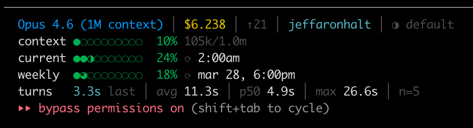

# claude-statusline

A multi-line statusline for [Claude Code](https://claude.ai/code) with gradual-fill progress bars, real-time rate limits, and per-turn timing stats.



## What it shows

**Line 1:** Model name, session cost, output tokens, directory (branch), session duration, thinking effort

**Stacked bars:**
| Row | Description |
|-----|-------------|
| `context` | Context window usage with token counts |
| `current` | 5-hour rate limit with reset time |
| `weekly` | 7-day rate limit with reset date |
| `turns` | Per-turn wall-clock timing: count, last, avg, p50, max |

Progress bars use gradual-fill dots (`○ ◔ ◑ ◕ ●`) and color-code from green to red as usage increases.

Turn timing captures full wall-clock time per turn (thinking + tool calls + subagents), not just API latency.

## Choose your flavor

Two implementations are available — pick whichever suits your setup:

| | [`ts/`](ts/) | [`sh/`](sh/) |
|---|---|---|
| **Files** | 1 (`statusline.ts`) | 3 (`statusline.sh` + 2 hook scripts) |
| **Runtime** | Node.js + `tsx` | Bash + `jq` + `python3` + `curl` |
| **Deps** | `npx tsx` | `brew install jq` (rest ships with macOS) |

Both produce identical output.

---

## TypeScript setup

Single file handles statusline + hooks via CLI args.

```bash
cp ts/statusline.ts ~/.claude/statusline.ts
chmod +x ~/.claude/statusline.ts
```

Add to `~/.claude/settings.json`:

```json
{
  "hooks": {
    "UserPromptSubmit": [
      {
        "hooks": [
          {
            "type": "command",
            "command": "npx tsx \"$HOME/.claude/statusline.ts\" start",
            "timeout": 5
          }
        ]
      }
    ],
    "Stop": [
      {
        "hooks": [
          {
            "type": "command",
            "command": "npx tsx \"$HOME/.claude/statusline.ts\" stop",
            "timeout": 5
          }
        ]
      }
    ]
  },
  "statusLine": {
    "type": "command",
    "command": "npx tsx \"$HOME/.claude/statusline.ts\" statusline"
  }
}
```

---

## Shell setup

Three scripts — statusline + two hook scripts for turn timing.

### Prerequisites

- `jq` (`brew install jq` on macOS)
- `python3` (ships with macOS)
- `curl` and `git`

```bash
cp sh/statusline.sh ~/.claude/statusline.sh
mkdir -p ~/.claude/scripts
cp sh/turn-timing-start.sh ~/.claude/scripts/turn-timing-start.sh
cp sh/turn-timing-stop.sh ~/.claude/scripts/turn-timing-stop.sh
chmod +x ~/.claude/statusline.sh ~/.claude/scripts/turn-timing-*.sh
```

Add to `~/.claude/settings.json`:

```json
{
  "hooks": {
    "UserPromptSubmit": [
      {
        "hooks": [
          {
            "type": "command",
            "command": "bash \"$HOME/.claude/scripts/turn-timing-start.sh\"",
            "timeout": 2
          }
        ]
      }
    ],
    "Stop": [
      {
        "hooks": [
          {
            "type": "command",
            "command": "bash \"$HOME/.claude/scripts/turn-timing-stop.sh\"",
            "timeout": 2
          }
        ]
      }
    ]
  },
  "statusLine": {
    "type": "command",
    "command": "bash \"$HOME/.claude/statusline.sh\""
  }
}
```

---

## How turn timing works

Two hooks capture wall-clock time per turn:

1. **`UserPromptSubmit`** records a millisecond timestamp when you press enter
2. **`Stop`** fires when Claude finishes, computes the delta, and appends to a per-session history file (`/tmp/claude/turns-{session_id}.log`)

The statusline reads the history and computes last/avg/p50/max stats. History is per-session and resets on restart.

## Base

The shell version is built on top of [kamranahmedse/claude-statusline](https://github.com/kamranahmedse/claude-statusline). The TypeScript version is a clean rewrite with identical output.

Additions over the original:

- Gradual-fill progress dots (`◔ ◑ ◕ ●`)
- Context window bar stacked above rate limit bars
- Session cost and output tokens on line 1 (replacing redundant context %)
- Per-turn wall-clock timing via `UserPromptSubmit` / `Stop` hooks

## License

MIT
